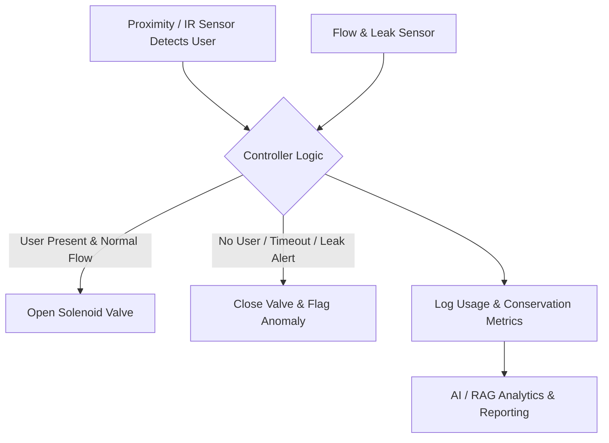

# System Architecture Flow

```mermaid
flowchart TD
    A[Proximity / IR Sensor Detects User] --> B{Controller Logic}
    C[Flow & Leak Sensor] --> B
    B -->|User Present & Normal Flow| D[Open Solenoid Valve]
    B -->|No User / Timeout / Leak Alert| E[Close Valve & Flag Anomaly]
    B --> F[Log Usage & Conservation Metrics]
    F --> G[AI / RAG Analytics & Reporting]
```
